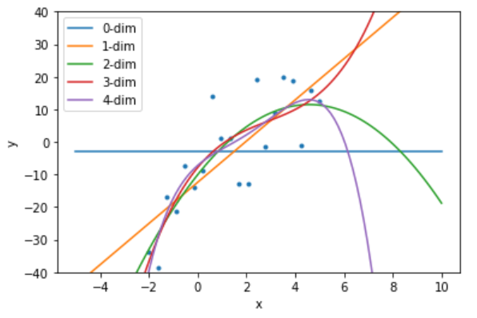

# センシング工学第１１回演習回

## numpy/matplotlibを使った直線当てはめ及び多項式回帰

上のボタンを押すと、Google colaboratoryでオープンし、実行することができます。その場合自分のColaboratoryかGoogle Driveにコピーを保存しておかないとタブを消去したら消えてしまいますので注意してください。

ダウンロードしてローカルPCのjupyter notebook上で動作させることも可能です。その場合はローカルのpython環境に「numpy」「Matplotlib」をpipやanacondaをつかってインストールしておいてください。

回帰パラメータの共分散の導出についての補足読み物資料もここにおいていますので読んでみてください。

[補足読み物](%E3%82%BB%E3%83%B3%E3%82%B7%E3%83%B3%E3%82%B0%E5%B7%A5%E5%AD%A6%E7%B7%9A%E5%BD%A2%E5%BD%93%E3%81%A6%E3%81%AF%E3%82%81.pdf?raw=true)

[第１１回授業補足スライド](slides.pdf?raw=true)

